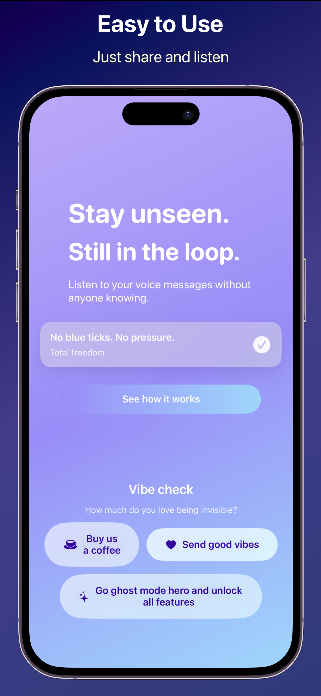
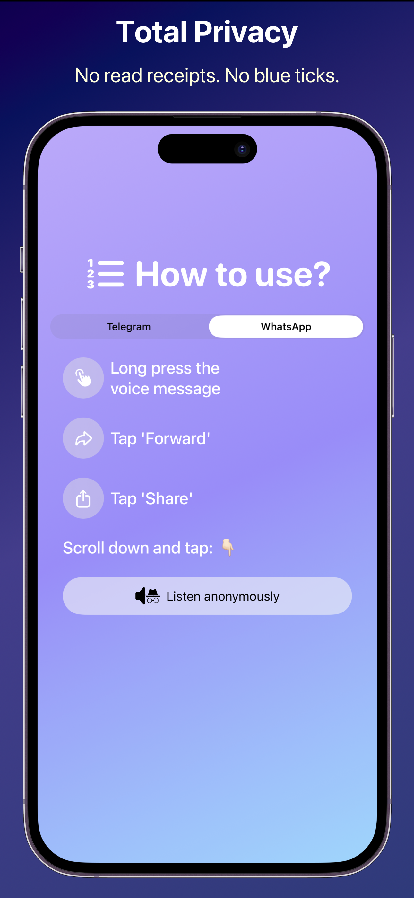
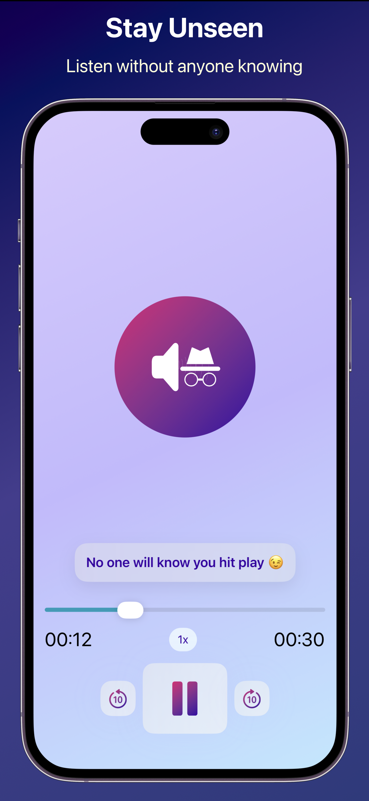

#  Listen anonymously

[](https://github.com/lfcj/listen-anonymously/actions/workflows/code-coverage.yml)
[](https://codecov.io/gh/lfcj/listen-anonymously)

This is an app that allows listening anonymously to voice recordings in Whatsapp, Telegram or iMessage.
The app does not notice that the recording was listened to and does not show the checkmarks.

## Quick snapshot

Here is what the app does and how it looks:

[](https://www.youtube.com/watch?v=9Dk3CZHV0aM)

## Screenshots

Screenshots are captured for all supported localizations using the `Listen-anonymously-Snapshot-Tests` unit test target and framed with `frameit`. The framing configuration     lives in `fastlane/Framefile.json`, and each locale has its own `keyword.strings` and `title.strings` in `fastlane/screenshots/<locale>/`.

| Front Door | Instructions | Now Playing |
|:-:|:-:|:-:|
|  |  |  |

## Architecture

The project follows **MVVM (Model-View-ViewModel)** with reactive state management via Combine and `@Published` properties. Views are built in SwiftUI and receive their view models through constructor injection, keeping them stateless and testable. An `AppState` observable object manages global state such as tab selection and setup completion. The shared framework acts as the domain layer, exposing protocols and view models that both the main app and the extension consume without knowing each other's implementation details.

## Technology

- **SwiftUI** for all views across the app and extension.
- **UIKit** only where required: the extension entry point `ActionViewController` (Xcode constraint) and snapshot tests that need a `UIWindow` context for components like `Picker`.
- **Swift 6 concurrency**: `async`/`await`, `Sendable` types, `@MainActor` annotations, `TaskGroup` for concurrent audio-file detection, and `AsyncStream` for event propagation.
- **Combine** for reactive data flow in view models (`@Published`, timer streams, async streams for purchases).
- **Heavily modularized**: the `Listen Anonymously Shared` framework contains all reusable logic and could be extracted into an independent Swift package.
- **Custom dependency injection** using an `actor`-based `InjectionResolver` with a type-safe `@Inject` property wrapper, plus constructor injection throughout.
- **Strong SOLID development:**
    -   **Single Responsibility Principle:** The main app and the extension each have a single purpose: show the front door/instructions, and play audio, respectively. All reusable logic lives in `Listen Anonymously Shared`. A natural next step would be splitting this framework into a UI layer and a core-logic layer.
    -   **Open/Closed Principle:** Most reusable models in the framework are marked `open`, allowing tests and snapshot configurations to inject new behavior without modifying production code.
    -   **Liskov Substitution Principle:** Protocols such as `DeeplinkVerifying`, `AudioSessionProtocol`, and `PostHogProtocol` enable seamless substitution of implementations. Constructor injection makes this practical everywhere, e.g. `AudioPlayingView` accepts a view model that can be preconfigured to simulate 12 seconds of playback in a snapshot, for example.
    -   **Interface Segregation Principle:** Fine-grained protocols (`PostHogProtocol`, `AudioSessionProtocol`, `PurchasesClient`, `RevenueCatConfigProviding`) keep interfaces focused. Further segregation is a work in progress.
    -   **Dependency Inversion Principle:** `AudioPlayingManager` abstracts away `AVAudioPlayer`; consumers would not notice a change in the underlying player. Third-party dependencies are wrapped in protocols (`PostHogProtocol` for analytics, `PurchasesClient` for RevenueCat) or injected as closures (`telegramConverter` for SwiftOGG).

## Proud milestones

- **>90% code coverage** tracked via Codecov, enforced in CI.
- **Multi-layer testing strategy**: unit tests (Swift Testing macros), SwiftUI view tests via `ViewInspector`, snapshot tests across 10+ device configurations (iPhone 8 through iPad Pro 13), and UI tests.
- **37-locale localization** with a custom `My.localizedString` system that supports runtime locale overrides for snapshot testing.
- **CI/CD pipeline**: GitHub Actions runs tests on macOS with the latest Xcode, generates Cobertura coverage reports, and uploads to Codecov. Fastlane automates building, screenshot capture/framing, and App Store Connect uploads.
- **SwiftLint** enforced in CI for consistent code style.
- **Secrets management**: sensitive values (`DEVELOPMENT_TEAM`, API keys) live in git-ignored `.xcconfig` files locally and are injected from GitHub Action Secrets in CI.
- **Tuist** for declarative project generation, eliminating `.pbxproj` merge conflicts.
- **Accessibility identifiers** defined in a dedicated enum for reliable UI testing.
- **Custom error types** with localized descriptions (`FindingAudioError`) for user-facing error messages.
- **Protocol-wrapped third-party dependencies** (RevenueCat, PostHog, AVAudioSession) to keep the codebase vendor-agnostic and testable.


### Test coverage

[](
https://codecov.io/gh/lfcj/listen-anonymously
)

- App has >90% test coverage ✅
- SwiftUI views are heavily tested using [`ViewInspector`](https://github.com/nalexn/ViewInspector). The goal was to have all the logic in view models, modify them, and inspect the view to make sure it displays the modified data accordingly.

## Project Setup with Tuist

This project uses **Tuist** for project generation, removing the need to commit `.pbxproj` files and making project configuration more maintainable.

### Quick Start

#### Using Bash

```bash
chmod +x scripts/setup-tuist.sh
./scripts/setup-tuist.sh
```

#### Using Fish Shell + mise (Recommended)

```fish
chmod +x scripts/setup-tuist.fish
./scripts/setup-tuist.fish
```

Then open the workspace:

```bash
open "Listen anonymously.xcworkspace"
```

For detailed setup instructions:
- **General setup**: See [TUIST_SETUP.md](TUIST_SETUP.md)
- **Fish shell + mise**: See [FISH_SHELL_GUIDE.md](FISH_SHELL_GUIDE.md)

### Build Configuration via xcconfig

- Hiding sensitive data such as the `DEVELOPMENT_TEAM` is done using `.xcconfig` files that are local. Manual sign-in was also implemented by using provisioning files.
- Deployment target is also managed in `xcconfig` file in order to avoid having to manually modify the Build Settings of all targets.
- `Secrets.xcconfig` is a local file that is git-ignored. It includes the development team information. In the CI, the workflow reads a Github Action Secret with the same data and creates the `xcconfig` file with it.
- Project structure is defined in `Project.swift` using Tuist's declarative API.

## CI
Github Actions is used to make sure all tests pass and the code coverage remains high.
[code-coverage.yml](https://github.com/lfcj/listen-anonymously/blob/main/.github/workflows/code-coverage.yml) forces usage of Xcode-26, runs tests and uploads code coverage results to CODECOV.

🚧 Trigger upload to ASC

### Capture and frame screenshots for all localizations

```
bundle exec fastlane ios screenshots
```

This runs the `Listen-anonymously-Snapshot-Tests` target, which programmatically renders each view using `SnapshotConfiguration` for all 37 App Store Connect locales: ar-SA, cs, da, de-DE, el, en-AU, en-GB, en-US, es-ES, es-MX, fi, fr-CA, fr-FR, he, hi, hr, hu, id, it, ja, ko, ms, nl-NL, no, pl, pt-BR, pt-PT, ro, ru, sk, sv, th, tr, uk, vi, zh-Hans, zh-Hant.

Screenshots are saved to `fastlane/screenshots/<locale>/` locally and then framed with device bezels via `frameit`.

### Upload screenshots to App Store Connect

```
bundle exec fastlane ios upload_screenshots
```

This uploads the framed screenshots from `./fastlane/screenshots/` to ASC without touching the binary or metadata.

## `fastlane`

### Running fastfile locally

This repo is using `rbenv` to avoid installing dependencies globally, so first run `bundle install`.

To run all tests, do:

```
bundle exec fastlane ios all_tests
```

or execute
```
bundle exec fastlane lanes
```

to see all available lanes.

### Build for App Store

```
bundle exec fastlane ios build
```

This generates the Tuist project and builds the app with `app-store` export method. The `.ipa` is saved to `./fastlane/build_output/`.

### Build and upload to App Store Connect

```
bundle exec fastlane ios release
```

This builds the app and uploads it to ASC (skipping screenshots, including metadata).

### Build and release with screenshots

To create a full release with freshly captured screenshots:

```
bundle exec fastlane ios screenshots
bundle exec fastlane ios release
bundle exec fastlane ios upload_screenshots
```

### Upload metadata only

```
bundle exec fastlane ios upload_metadata
```

## Design system
🚧 Goal is to have a framework with design specs in JSON that gets mapped into Swift code. Names are semantic. The goal is to be able to export it to a package and be able to import it to every new private app. This allows homogeneity and consistent branding.

## Q&A

Reach out to hello@mqslimited.co for any questions or ideas.
